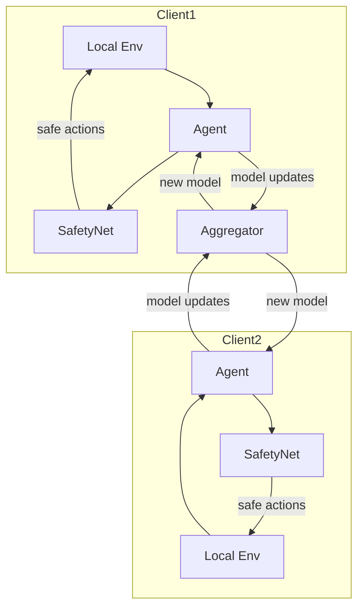

# Safety-Enhanced Hierarchical Federated RL Microgrid


## Overview

This repository houses a simplified template for building a **Safety-Enhanced Hierarchical Federated Reinforcement Learning (FedRL) platform for microgrids**. The framework aims to coordinate multiple microgrids that each learn a local policy while securely collaborating with others. A hierarchical control architecture is envisioned where clusters of clients train locally and share model updates with an aggregator that orchestrates global policy improvements. Safety is a first-class citizen in this design: each action proposed by a local agent may be filtered by a `SafetyNet` that prevents unsafe actions from being executed on the physical grid. While the current code base offers placeholders rather than a fully functioning implementation, it lays out the necessary modules and configuration files so that future contributors can build on a consistent foundation.

The project exists at the intersection of smart-grid control and modern reinforcement learning. Microgrids are small-scale power systems that can operate independently or in concert with the main grid, often integrating renewable energy sources such as solar or wind. Coordinating many microgrids requires balancing efficiency, robustness, and safety. Federated learning offers a privacy-friendly way to aggregate experience from many sites without centralizing raw data. Coupling this with RL allows each microgrid to adapt to local conditions while benefiting from a shared global policy. Safety enhancements ensure that exploration steps do not compromise grid stability or violate operational constraints.

## Project Scope

This template does not yet implement a complete simulator, agent, or communication backend. Instead, it focuses on a modular skeleton to highlight the high-level workflow:

1. **Environment and Agent Wrappers** – under `src/envs` and `src/agents` you can extend typical RL environments and algorithms to interface with microgrid hardware or simulators.
2. **SafetyNet** – defined in `src/safety/safetynet.py`, this placeholder class exposes methods like `is_safe` and `is_safe_batch` to evaluate whether certain actions are permitted.
3. **Local Training** – `src/trainers/local_trainer.py` demonstrates a minimal training loop where an agent interacts with an environment, and the SafetyNet influences the set of available actions.
4. **Federated Aggregation** – `src/trainers/aggregator.py` includes a simple `fed_avg` function that averages parameter dictionaries. In a real deployment, this component would also handle communication across networks and potentially differential privacy.
5. **Configuration** – YAML files in `configs` describe clusters of clients and hyperparameters. They provide a quick starting point to adjust the simulated environment or the RL algorithm.

Users are encouraged to expand these modules to suit their microgrid experiments, add real models, and implement robust communication protocols for federation.

## Installation Guide

This project targets Python 3.10 or later and assumes that PyTorch is available for neural network implementations. The following steps outline a typical installation process:

1. **Clone the repository**
   ```bash
   git clone https://github.com/your-org/FunnyK1ng.git
   cd FunnyK1ng
   ```
2. **Create a virtual environment** (optional but recommended)
   ```bash
   python3 -m venv .venv
   source .venv/bin/activate
   ```
3. **Install dependencies**
   Although the repository currently lacks a `requirements.txt`, a basic setup may include packages like `numpy`, `torch`, and `pyyaml`:
   ```bash
   pip install numpy torch pyyaml
   ```
   If a `requirements.txt` file is later provided, you can install using `pip install -r requirements.txt`.

4. **Run a quick test**
   After installation, try executing the training entry point:
   ```bash
   python microgrid-fedrl/scripts/train.py
   ```
   This will launch the minimal training loop. Since the modules are placeholders, no real learning occurs yet, but the script should run without errors once the environment and agent are properly defined.

## Basic Usage Example

Below is a basic outline for customizing and running a federated training session. Real experiments may require additional infrastructure, but the skeleton demonstrates the essential steps.

1. **Prepare configuration files**
   - `configs/hparams.yaml` sets global hyperparameters such as `learning_rate`, `local_episodes`, and `cluster_size`.
   - The `configs/clients/` directory holds individual client settings. For now these files are nearly empty, but you can populate them with paths to time-series data or custom modules.
   - `configs/clusters.yaml` lists which clients belong to each cluster. The default configuration divides nine clients evenly into three clusters.

2. **Implement environment and agent**
   - Extend the environment wrapper in `src/envs` to connect to a microgrid simulator. Each environment should support standard RL methods like `reset` and `step`.
   - Implement an agent in `src/agents` using your preferred RL algorithm (e.g., Deep Q-Network, Proximal Policy Optimization). The agent should expose a callable interface that returns Q-values or actions.

3. **Customize the SafetyNet**
   - Replace the placeholder `SafetyNet` implementation with a model that understands which states or actions violate safety constraints. It might reference domain knowledge about voltage limits, equipment ratings, or regulatory policies.

4. **Run training**
   With the components in place, you can start local training for a single client:
   ```bash
   python microgrid-fedrl/scripts/train.py
   ```
   In a full federated setup, each client would run a similar process and periodically send model parameters to an aggregator. The aggregator would then compute a new global model using `fed_avg` or a more advanced algorithm, distributing updates back to clients.

## Parameter Explanation

The `configs/hparams.yaml` file defines several key parameters that affect how learning proceeds. Their current default values are mostly placeholders, but they illustrate the types of settings you might adjust:

- `learning_rate` – The step size used by the optimizer when updating network weights. A smaller value can yield more stable learning but may require more training iterations.
- `local_episodes` – Number of episodes a client trains locally before synchronizing with the aggregator. This parameter trades off computation time on the client against communication overhead.
- `n_step` – Controls the number of steps to look ahead when computing n-step returns in algorithms like Q-learning. Larger values incorporate more future reward information but may increase variance.
- `cluster_size` – How many clients belong to each training cluster. Clustering affects both the performance of the global model and the resiliency of the overall system.
- `safety_tau` – A threshold representing the probability that an action deemed safe by the SafetyNet should actually be executed. This allows the system to tune how conservative or aggressive the safety filter behaves.

These parameters can be adjusted by editing `hparams.yaml` before starting the training script. A more sophisticated implementation could expose them via command-line arguments.

## Directory Layout

The repository is intentionally lightweight yet structured to be extensible. The root directory contains two main items: the `.csproj` file (from a previous prototype) and a folder named `microgrid-fedrl`. Inside this folder are several subdirectories:

```text
microgrid-fedrl/
├── configs/            # YAML configs for environments and experiments
│   ├── clients/        # per-client configuration files
│   ├── clusters.yaml   # grouping of clients into clusters
│   └── hparams.yaml    # hyperparameter defaults
├── data/               # generated time-series or datasets
├── src/
│   ├── envs/           # environment wrappers and interfaces
│   ├── safety/         # SafetyNet model definitions
│   ├── agents/         # RL agents and federated wrappers
│   ├── trainers/       # local trainers and aggregators
│   └── utils/          # utility functions used across modules
├── scripts/            # CLI for training/evaluation
└── results/            # tensorboard logs and checkpoints
```

By following this layout, you can incrementally replace placeholders with real code while keeping the overall structure tidy.

## Workflow Diagram

The following Mermaid diagram visualizes the envisioned workflow from local training to federated aggregation. It depicts how each microgrid interacts with the SafetyNet and contributes updates to a central aggregator. The aggregator then disseminates an improved global model back to clients.



This simple diagram outlines two clients, but the same pattern scales to many more. Each client relies on the SafetyNet to filter dangerous decisions while training. After a set of local episodes, model updates are pushed to the aggregator. The aggregator performs federated averaging (or another scheme) and broadcasts the updated parameters back to all clients.

## Contributing

Contributions are welcome. Because this repository is currently a minimal framework, there are numerous directions for improvement:

- Implement real RL algorithms and environment wrappers under `src/agents` and `src/envs`.
- Expand the `SafetyNet` to incorporate domain knowledge or a learned model of constraints.
- Add a configuration management system to handle different microgrid setups more gracefully.
- Integrate a communication layer that supports asynchronous updates, fault tolerance, and security.
- Provide comprehensive tests and benchmarks.

If you plan to contribute, please open an issue to discuss your proposed changes. Pull requests should be made against the main branch and include clear documentation and test cases where applicable.

## Future Work

At present, this repository is a starting point rather than a mature toolkit. Future efforts may include a complete microgrid simulator, advanced federated optimization strategies, and integration with real hardware controllers. The community's feedback will shape the roadmap, so feel free to share your ideas.

## License

Unless otherwise specified, this project is released under the MIT License. See `LICENSE` for details.

## Acknowledgements

This template was assembled to help researchers and engineers collaborate on safe federated reinforcement learning methods for microgrid applications. It draws inspiration from standard RL libraries and microgrid control literature but leaves ample room for customization. We hope it serves as a useful scaffold for your own experiments and deployments.

